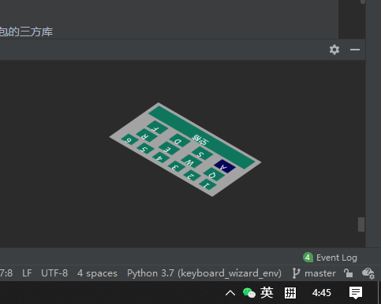
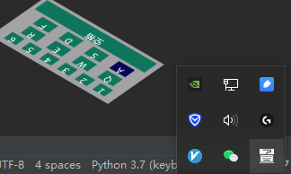

# Keyboard_wizard

利用 Python 实现桌面动态展示键盘

当前简单 p 了几张图片用于展示，后续可以自行优化

### 1. 效果图

---


### 2. 首先安装依赖
建议创建虚拟环境，避免环境影响
```bash
pip install -r requirements.txt 
```

### 3. 执行程序
直接 `python main.py` 启动即可

---
当前程序已经打包了 exe 成品，可通过以下方式自行打包
py 打包为 exe
> 打包命令
> ```bash
>  pyinstaller -Fwi 1.ico main.py --exclude-module pyinstaller
> ```
> - 1.ico 程序图标
> - main.py 打包的 py 脚本
> - exclude-module 不需要打包的三方库  
> 注意：打包时需要将图片转成对象，如`main.py`中`Image`对象，使用`img2py.py`进行转换